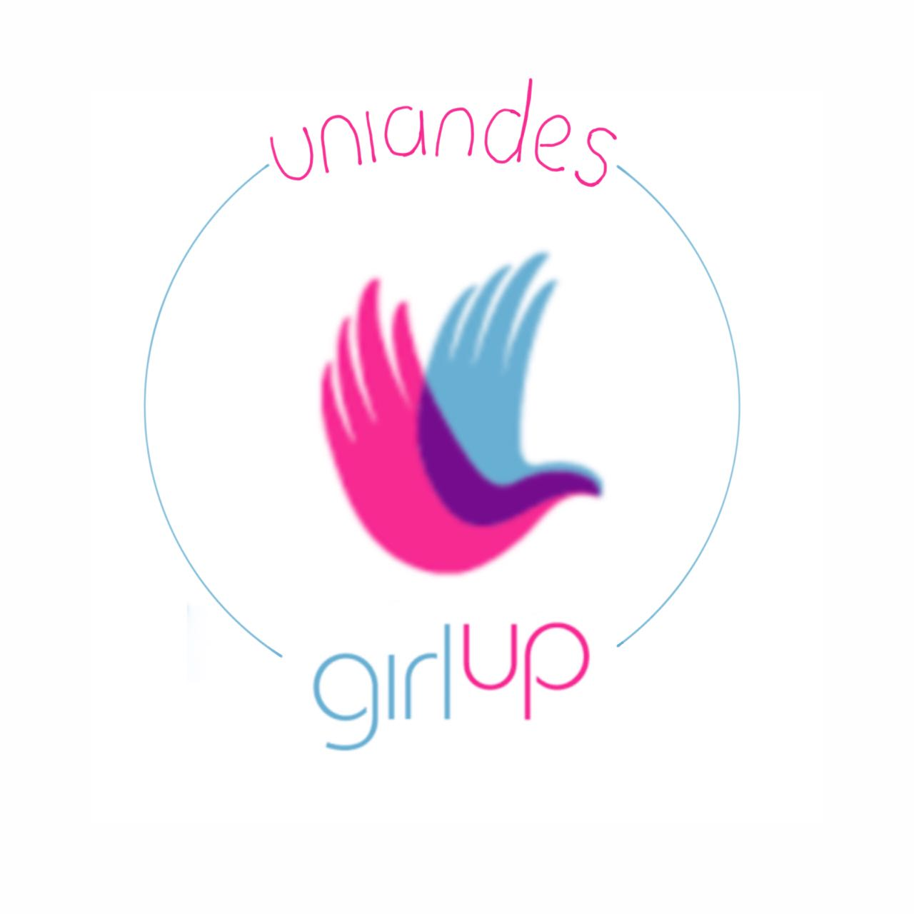
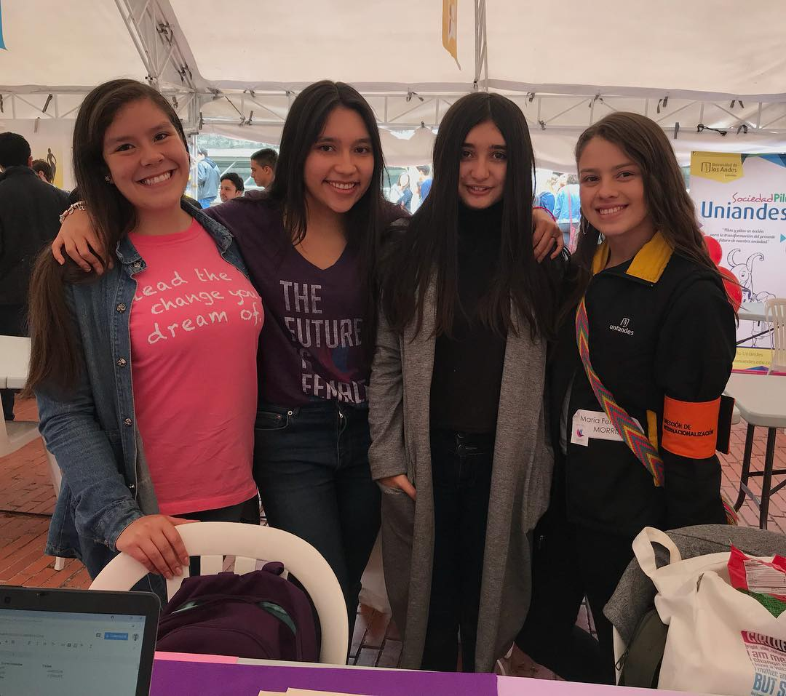

  

# ¡Bienvenidos a Girl Up Uniandes! 

### ¡Esta es la página web de [Girl Up Uniandes](https://girlup-uniandes.github.io/)!
#### ¿Quieres participar? [Inscríbete aquí](https://forms.office.com/Pages/ResponsePage.aspx?id=fAS9-kj_KkmLu4-Yufucynr0Ske4AbBPrSHUPJVzvD9UNzY2UUxMWkRISEVLN0dHMkRCVDZOWjNYSS4u)
###### View this readme in [English](#welcome-to-girl-up-uniandes)

  <h4>
    <a href="https://girlup-uniandes.github.io/">
      ¡Visita nuestra página!
    </a>
     | 
    <a href=(#sobre-girl-up)>
      Sobre Girl Up
    </a>
     | 
    <a href=(#sobre-girl-up-uniandes)>
      Sobre Girl Up Uniandes
    </a>
     | 
    <a href="https://github.com/CCOSTAN/Home-AssistantConfig/issues?q=is%3Aissue+is%3Aopen+sort%3Aupdated-desc">
      Corre el proyecto localmente
    </a>
    | 
    <a href="https://github.com/CCOSTAN/Home-AssistantConfig/issues?q=is%3Aissue+is%3Aopen+sort%3Aupdated-desc">
      Contribuye a la página
    </a>
  </h4>

Si quieres contribuir a nuestra página o ayudarnos a mejorar, ¡no dudes en hacer un [Pull Request](https://github.com/GirlUp-Uniandes/GirlUp-Uniandes.github.io/pulls)! 

## Sobre Girl Up
  
 
 <a href="https://girlup.org/">Girl Up</a> es una iniciativa apoyada por la Fundación de las Naciones Unidas que busca, por medio del liderazgo y el activismo sobre los derechos humanos, ayudar a jóvenes alrededor del mundo a tomar acción en sus comunidades mediante proyectos de alto impacto social para la igualdad de género. Nuestro objetivo es crear un equipo de líderes críticos y comprometidos con la ejecución de proyectos multidisciplinares, que conlleven a la solución de problemáticas que enfrentamos las nuevas generaciones relacionadas con la igualdad de género, la desigualdad social y el cambio ambiental. 

  
Si quieres conocer más sobre Girl Up, ¡haz click en este <a href="https://girlup.org/">link!</a>

 

#### Hecho con :heart: &nbsp; por [@camilalonart](https://github.com/camilalonart) y [@sofiaalvarezlopez](https://github.com/sofiaalvarezlopez)

 ## Sobre Girl Up Uniandes
 
Con <a href="https://girlup-uniandes.github.io//">Girl Up Uniandes</a> queremos generar un impacto en nuestra comunidad uniandina, en nuestra ciudad, Bogotá y en nuestro país, Colombia. Descubre nuestro programa de mentorías para niñas de colegio, estudiantes de primer semestre y estudiantes a punto de graduarse de la U. Ayúdanos a promover la educación, porque educar a una niña, es educar a todo un país. ¡Apóyanos a llevar STEAM (ciencia, tecnología, ingeniería, arte y matemáticas) a todos los rincones de nuestro hermoso país y del mundo! ¿Quieres apoyarnos? ¿Tienes grandes ideas para compartir? ¡Compártenos tu historia! <a href="https://forms.office.com/Pages/ResponsePage.aspx?id=fAS9-kj_KkmLu4-Yufucynr0Ske4AbBPrSHUPJVzvD9UNzY2UUxMWkRISEVLN0dHMkRCVDZOWjNYSS4u">Inscríbete aquí</a>

#### Hecho con :heart: &nbsp; por [@camilalonart](https://github.com/camilalonart) y [@sofiaalvarezlopez](https://github.com/sofiaalvarezlopez)

  

# Welcome to Girl Up Uniandes!

### This is [Girl Up Uniandes' webpage](https://girlup-uniandes.github.io/)!
#### Want to take action? [Join us!](https://forms.office.com/Pages/ResponsePage.aspx?id=fAS9-kj_KkmLu4-Yufucynr0Ske4AbBPrSHUPJVzvD9UNzY2UUxMWkRISEVLN0dHMkRCVDZOWjNYSS4u)
###### Ver este readme en [Español](#bienvenidos-a-girl-up-uniandes)

  <h4>
    <a href="https://girlup-uniandes.github.io/">
      Visita our webpage!
    </a>
     | 
    <a href="https://www.vCloudInfo.com/tag/iot">
      About Girl Up
    </a>
     | 
    <a href="https://github.com/CCOSTAN/Home-AssistantConfig#devices">
      About Girl Up Uniandes
    </a>
     | 
    <a href="https://github.com/CCOSTAN/Home-AssistantConfig/issues?q=is%3Aissue+is%3Aopen+sort%3Aupdated-desc">
      Run the project locally
    </a>
    | 
    <a href="https://github.com/CCOSTAN/Home-AssistantConfig/issues?q=is%3Aissue+is%3Aopen+sort%3Aupdated-desc">
      Contribute to the webpage
    </a>
  </h4>

If you want to contribute or help us improve, please make a [Pull Request](https://github.com/GirlUp-Uniandes/GirlUp-Uniandes.github.io/pulls)!

If you want more information about Girl Up, please follow this [link!](https://girlup.org/)

#### Made with :heart: &nbsp; by [@camilalonart](https://github.com/camilalonart) and [@sofiaalvarezlopez](https://github.com/sofiaalvarezlopez)

