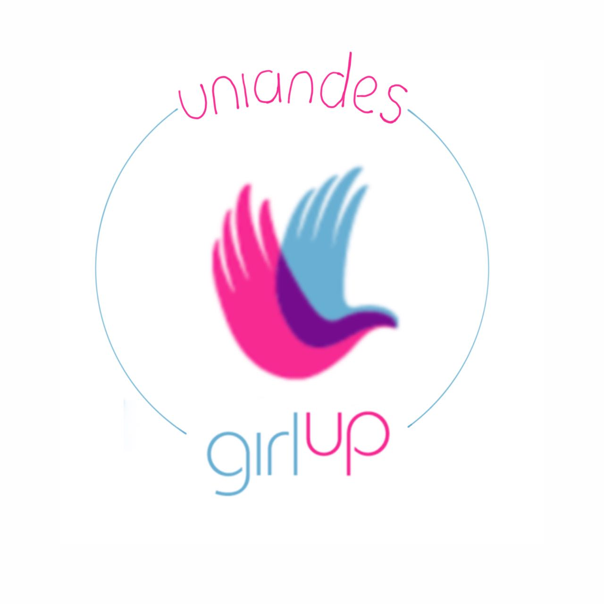
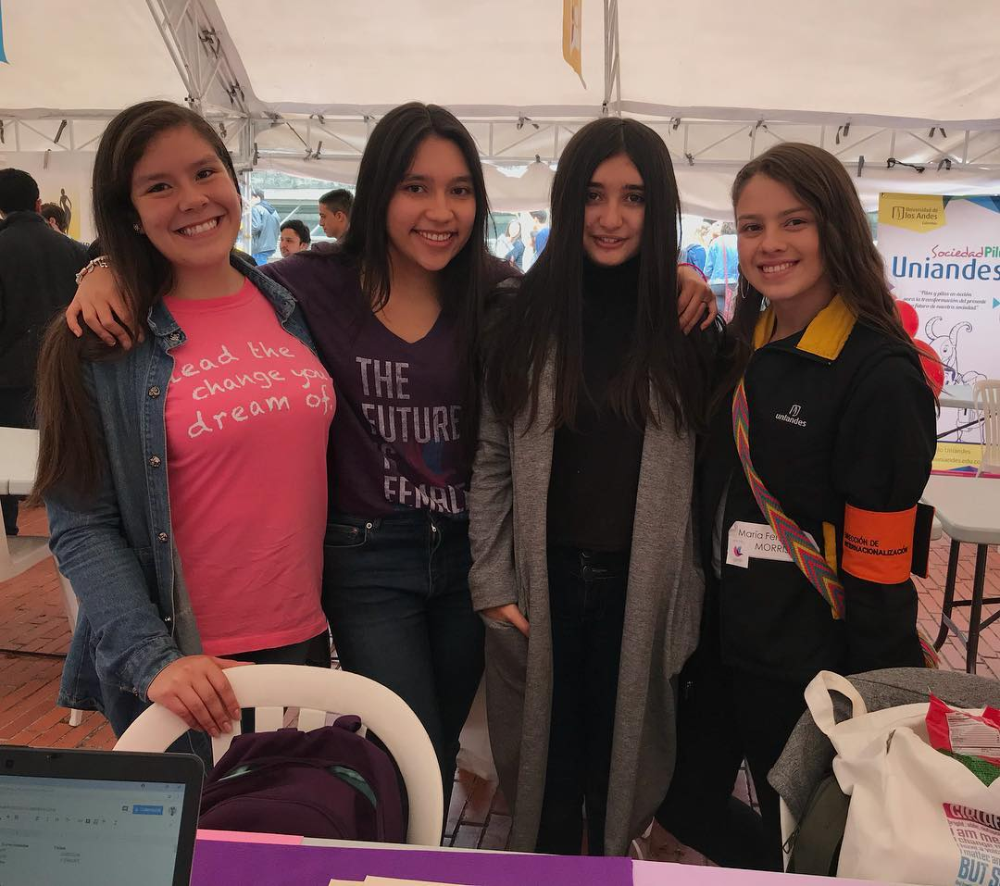

  

# ¡Bienvenidos a [Girl Up Uniandes](https://girlup-uniandes.github.io/)! 
### ¿Quieres participar? [¡Inscríbete aquí!](https://forms.office.com/Pages/ResponsePage.aspx?id=fAS9-kj_KkmLu4-Yufucynr0Ske4AbBPrSHUPJVzvD9UNzY2UUxMWkRISEVLN0dHMkRCVDZOWjNYSS4u)
> Visítanos en nuestras redes sociales: &nbsp;&nbsp;&nbsp;&nbsp;

> View this readme in [English](#welcome-to-girl-up-uniandes)

  <h4>
    <a href="https://girlup-uniandes.github.io/">
      ¡Visita nuestra página!
    </a>
     | 
    <a href=#girl-up-es>
      Sobre Girl Up
    </a>
     | 
    <a href=#girl-up-uniandes-es>
      Sobre Girl Up Uniandes
    </a>
     | 
    <a href=#run-es>
      Corre el proyecto localmente
    </a>
    | 
    <a href=#contribuye-es>
      Contribuye a la página
    </a>
  </h4>

***

<h2 name="girl-up-es"> Sobre Girl Up </h2>
  
 
 <a href="https://girlup.org/">Girl Up</a> es una iniciativa apoyada por la Fundación de las Naciones Unidas que busca, por medio del liderazgo y el activismo sobre los derechos humanos, ayudar a jóvenes alrededor del mundo a tomar acción en sus comunidades mediante proyectos de alto impacto social para la igualdad de género. Nuestro objetivo es crear un equipo de líderes críticos y comprometidos con la ejecución de proyectos multidisciplinares, que conlleven a la solución de problemáticas que enfrentamos las nuevas generaciones relacionadas con la igualdad de género, la desigualdad social y el cambio ambiental. 

  
Si quieres conocer más sobre Girl Up, ¡haz click en este <a href="https://girlup.org/">link!</a>

 
 
### Visítanos en nuestras redes sociales: &nbsp;&nbsp;&nbsp;&nbsp;

##### Hecho con :heart: &nbsp; por [@camilalonart](https://github.com/camilalonart) y [@sofiaalvarezlopez](https://github.com/sofiaalvarezlopez)

***

 <h2 name="girl-up-uniandes-es"> Sobre Girl Up Uniandes</h2>
 
Con <a href="https://girlup-uniandes.github.io//">Girl Up Uniandes</a> queremos generar un impacto en nuestra comunidad uniandina, en nuestra ciudad, Bogotá y en nuestro país, Colombia. Descubre nuestro programa de mentorías para niñas de colegio, estudiantes de primer semestre y estudiantes a punto de graduarse de la U. Ayúdanos a promover la educación, porque educar a una niña, es educar a todo un país. ¡Apóyanos a llevar STEAM (ciencia, tecnología, ingeniería, arte y matemáticas) a todos los rincones de nuestro hermoso país y del mundo! 

 
¿Quieres apoyarnos? ¿Tienes grandes ideas para compartir? ¡Compártenos tu historia! <a href="https://forms.office.com/Pages/ResponsePage.aspx?id=fAS9-kj_KkmLu4-Yufucynr0Ske4AbBPrSHUPJVzvD9UNzY2UUxMWkRISEVLN0dHMkRCVDZOWjNYSS4u">Inscríbete aquí</a>

### Visítanos en nuestras redes sociales: &nbsp;&nbsp;&nbsp;&nbsp;

##### Hecho con :heart: &nbsp; por [@camilalonart](https://github.com/camilalonart) y [@sofiaalvarezlopez](https://github.com/sofiaalvarezlopez)

***

<h2 name="run-es">Corre el proyecto localmente</h2>

 

<ol>
  <li>Después de clonar el proyecto, entra a la carpeta <code>girl-up-uniandes.</code></li>
  <li>Si aún no tienes npm, <a href="https://www.npmjs.com/get-npm">instálalo</a>. Te recomendamos: <code> npm install npm@latest -g></code></li>
  <li>Corre <code>npm install</code> para instalar todas las librerías del proyecto. La primera vez que lo hagas, puede demorarse un poco.</li>
  <li>Corre <code>npm start</code> para ver el proyecto localmente.</li>
  <li>¡Ya estás listo! Ve a <a href="http://localhost:3000/">http://localhost:3000/</a> para ver la página y hacer tus cambios. ¡Usa tu editor de texto/código favorito!</li>
</ol>

### Visítanos en nuestras redes sociales: &nbsp;&nbsp;&nbsp;&nbsp;

##### Hecho con :heart: &nbsp; por [@camilalonart](https://github.com/camilalonart) y [@sofiaalvarezlopez](https://github.com/sofiaalvarezlopez)

***

<h2 name="contribuye-es">Contribuye a la página</h2> 

  

Si quieres contribuir a nuestra página, a alguno de nuestros proyectos o ayudarnos a mejorar, ¡no dudes en hacer un <a href="https://github.com/GirlUp-Uniandes/GirlUp-Uniandes.github.io/pulls">Pull Request</a>!
 

Si tienes alguna duda, escríbenos un correo a:

<ul>
  <li>girlupuniandes@uniandes.edu.co</li>
  <li>mc.londono@uniandes.edu.co</li>
  <li>ms.alvarezl@uniandes.edu.co</li>
  <li>camilalonart@gmail.com</li>
  <li>maria.sofia.alvarez.lopez@gmail.com</li>
</ul>

### Visítanos en nuestras redes sociales: &nbsp;&nbsp;&nbsp;&nbsp;
### Hecho con :heart: &nbsp; por [@camilalonart](https://github.com/camilalonart) y [@sofiaalvarezlopez](https://github.com/sofiaalvarezlopez)

***

  

# Welcome to Girl Up Uniandes!

### This is [Girl Up Uniandes' webpage](https://girlup-uniandes.github.io/)!
#### Want to take action? [Join us!](https://forms.office.com/Pages/ResponsePage.aspx?id=fAS9-kj_KkmLu4-Yufucynr0Ske4AbBPrSHUPJVzvD9UNzY2UUxMWkRISEVLN0dHMkRCVDZOWjNYSS4u)
###### Ver este readme en [Español](#bienvenidos-a-girl-up-uniandes)

  <h4>
    <a href="https://girlup-uniandes.github.io/">
      Visit our webpage!
    </a>
     | 
    <a href=#girl-up-es>
      About Girl Up
    </a>
     | 
    <a href=#girl-up-uniandes-es>
      About Girl Up Uniandes
    </a>
     | 
    <a href=#run-es>
      Run the project locally
    </a>
    | 
    <a href=#contribuye-es>
      Contribute to the webpage
    </a>
  </h4>

If you want to contribute or help us improve, please make a [Pull Request](https://github.com/GirlUp-Uniandes/GirlUp-Uniandes.github.io/pulls)!

If you want more information about Girl Up, please follow this [link!](https://girlup.org/)

#### Made with :heart: &nbsp; by [@camilalonart](https://github.com/camilalonart) and [@sofiaalvarezlopez](https://github.com/sofiaalvarezlopez)

